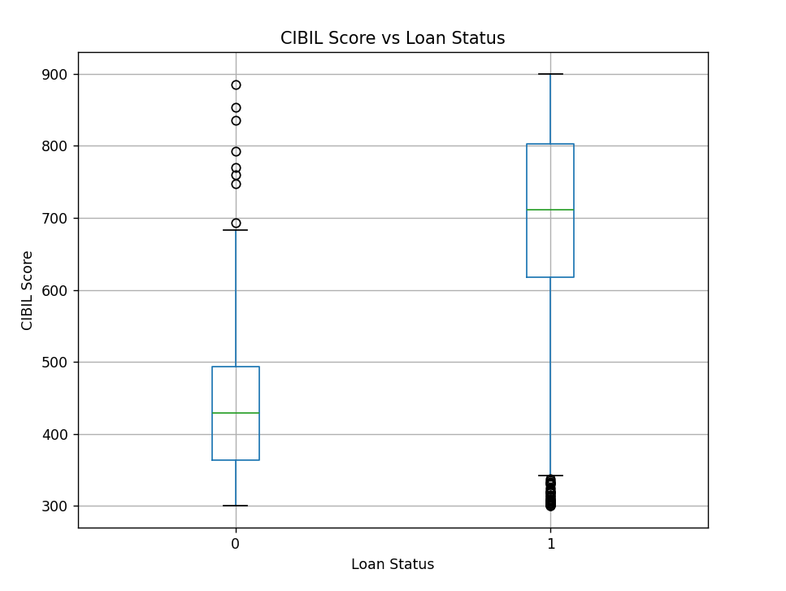
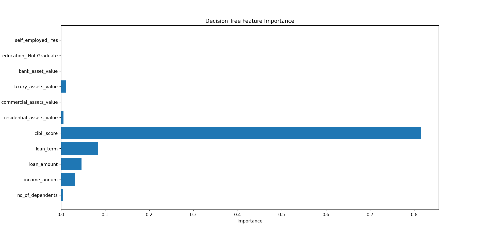

# Loan Approval Prediction System

## 1. Problem Statement
The objective of this project is to predict whether a loan application should be **approved or rejected** based on applicant financial and credit-related information.

In real-world loan systems, **precision and recall are more important than accuracy**:
- Approving a bad loan increases financial risk
- Rejecting a good applicant impacts customer trust

---

## 2. Dataset Description
The dataset contains historical loan application data with the following key features:
- Applicant income
- Credit score (CIBIL)
- Loan amount and loan term
- Number of dependents
- Education and employment status
- Asset-related information

**Target Variable**
- `loan_status`  
  - 1 → Approved  
  - 0 → Rejected

---

## 3. Data Preprocessing
The following steps were performed:
- Dropped non-informative identifier column (`loan_id`)
- Cleaned column names
- Encoded categorical variables (`education`, `self_employed`)
- Converted target variable to binary format
- Applied train–test split with stratification
- Scaled features for Logistic Regression only (to prevent data leakage)

---

## 4. Model Used
A **Decision Tree Classifier** was used for final interpretation and explainability.

Reasons:
- Easy to interpret
- Aligns with real-world decision rules
- Provides feature importance for transparency

Class imbalance was handled using weighted loss.

---

## 5. Model Evaluation
Evaluation focused on:
- Precision
- Recall
- F1-score
- Confusion Matrix

These metrics better reflect business risk compared to accuracy alone.

---

## 6. Data & Model Insights (Visual Analysis)
### 6.1 CIBIL Score vs Loan Status (Boxplot)

This boxplot compares the distribution of CIBIL scores for **rejected (0)** and **approved (1)** loan applications.

**How to read the boxplot**
- The Green horizontal line inside each box represents the **median CIBIL score**
- The box shows the **middle 50%** of applicants
- The vertical lines (whiskers) indicate the normal score range
- Individual dots represent **outliers**, which are uncommon cases

**Observations**
- Approved loans have a much higher median CIBIL score than rejected loans
- Most rejected applicants fall within a low credit score range
- Approved applicants are strongly concentrated at higher CIBIL values
- A small number of low-score approvals appear as outliers, indicating special cases such as high income or strong assets

**Interpretation**
The clear separation between the two groups shows that CIBIL score is a critical factor in loan approval decisions, while outliers reflect real-world exceptions rather than data errors.

---

### 6.2 Decision Tree Feature Importance

This bar chart shows how strongly each feature influenced the Decision Tree’s predictions.

**How to read the chart**
- Each bar represents a feature used by the model
- Longer bars indicate higher importance
- Importance values reflect how often and how effectively a feature was used for decision splits

**Observations**
- CIBIL score has the highest importance by a large margin
- Loan term, loan amount, and income provide secondary decision support
- Education, employment type, dependents, and asset values have minimal impact once credit score is known

**Interpretation**
The model relies primarily on credit history to make approval decisions, while other financial attributes help refine borderline cases. This behavior aligns closely with real-world loan evaluation practices.

---

## 7. Final Conclusion
- The model successfully captures real-world loan approval behavior
- Credit score is the most influential feature in decision-making
- Decision Trees provide strong interpretability for financial risk analysis
- Precision and recall-based evaluation ensures business-aligned outcomes
